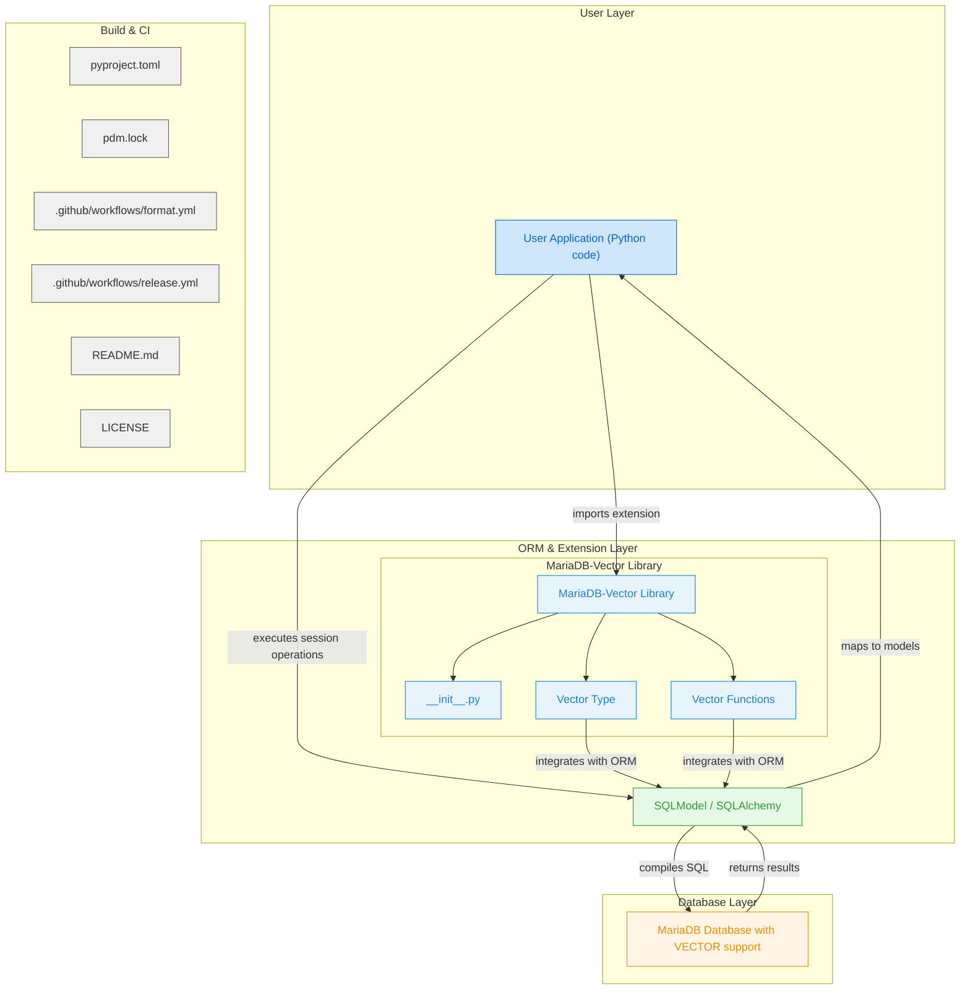

# MariaDB Vector
Integrate MariaDB's VECTOR type with SQL Alchemy and SQL Model

## Installation
```bash
pip install mariadb-vector
```

## Usage

### Add a vector column
```python
from sqlmodel import SQLModel, Field, Column
from mariadb_vector import Vector


class Item(SQLModel, table=True):
    embedding: list[float] = Field(sa_column=Column(Vector(3)))
```

### Insert a vector
```python
item = Item(embedding=[0.1, 0.2, 0.3])
session.add(item)
session.commit()
```

### Vector Search
The following functions are available for calculating vector distances:

`vec_from_seq(array: Sequence)`
- Converts a Python list or NumPy array into a database-compatible vector function.

`vec_distance(v1, v2)`
- Calculates a general distance between two vectors.

`vec_distance_euclidean(v1, v2)`
- Calculates the Euclidean distance between two vectors.

`vec_distance_cosine(v1, v2)`
- Calculates the cosine distance between two vectors.

```python
# Assume `engine` is already created and connected to your database.
with Session(engine) as session:
    target_vector = [0.1, 0.2, 0.3]
    query = (
        select(Item.id)
        .order_by(vec_distance_euclidean(Item.embedding, target_vector))
        .limit(2)
    )
    result = session.exec(query).all()
    print(result)
```

## Diagram


# Contributing
- This library is inspired by the [pgvector-python](https://github.com/pgvector/pgvector-python) and is built to bring similar functionality to MariaDB.
- Any contributions, bug reports, or improvements are welcome!
- Feel free to open issues or submit pull requests.
